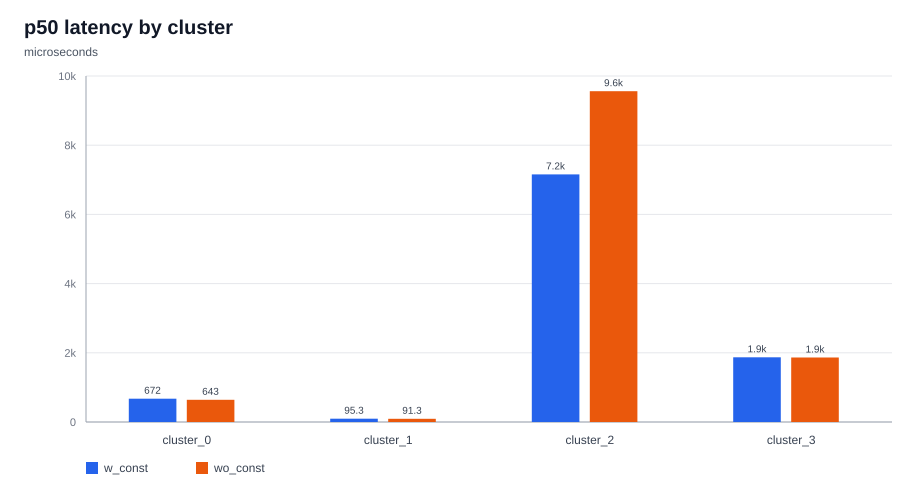
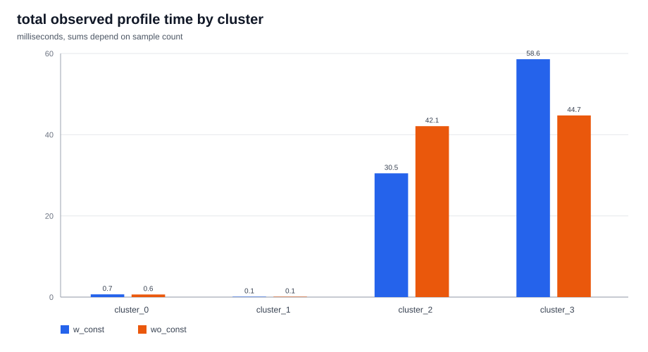
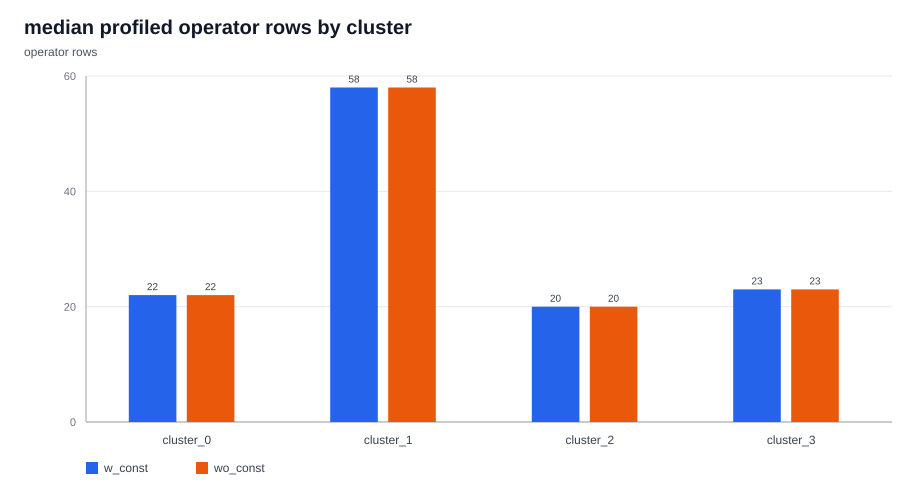
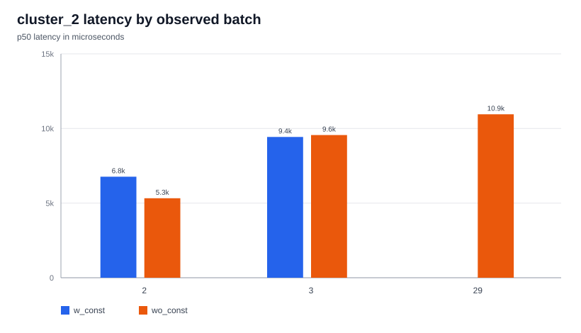

# All-cluster constant-folding comparison

Compared `w_const` from `with_constant_folding/cvr.log` against `wo_const` from `without_constant_folding/cvr.log` across every `Execution profile for cluster_*` block.

## Main takeaway

`cluster_3` does not look like the main structural effect of the constant-folding pass. It has the same `XlaNumConstantArgs_0__XlaNumResourceArgs_0_.180` signature in both logs, the same median profile operator-row count, and an almost identical all-sample p50 latency.

`cluster_2` is the direct hit. Its signature changes from `XlaNumResourceArgs_95` without constant folding to `XlaNumResourceArgs_55` with constant folding, while `XlaNumConstantArgs` stays at `45`. That matches the GraphDef pass folding trainable weights/bias/BN pieces into constants before XLA clustering.

## Figures

## Per-cluster profile summary

| cluster | w_const profiles | wo_const profiles | w_const p50 us | wo_const p50 us | wo - w us | wo / w | w_const op rows p50 | wo_const op rows p50 |
| --- | --- | --- | --- | --- | --- | --- | --- | --- |
| cluster_0 | 1 | 1 | 672.0 | 643.0 | -29.0 | 0.957 | 22 | 22 |
| cluster_1 | 1 | 1 | 95.3 | 91.3 | -4.0 | 0.958 | 58 | 58 |
| cluster_2 | 4 | 5 | 7155.0 | 9560.0 | 2405.0 | 1.336 | 20.0 | 20 |
| cluster_3 | 34 | 24 | 1870.0 | 1865.0 | -5.0 | 0.997 | 23.0 | 23.0 |

## cluster_2 by observed batch

| batch | w_const profiles | wo_const profiles | w_const p50 us | wo_const p50 us | wo - w us | wo / w | w_const op rows | wo_const op rows |
| --- | --- | --- | --- | --- | --- | --- | --- | --- |
| 2 | 3 | 2 | 6770.0 | 5325.0 | -1445.0 | 0.787 | 20,20,20 | 20,20 |
| 3 | 1 | 1 | 9430.0 | 9560.0 | 130.0 | 1.014 | 31 | 31 |
| 29 |  | 2 |  | 10950.0 |  |  |  | 7,7 |

The `cluster_2` aggregate p50 is higher in `wo_const`, but this is partly because the no-CF log has two `batch=29` `cluster_2` samples and the with-CF log does not. On matched samples, `batch=3` is close (`9430 us` vs `9560 us`), while `batch=2` is faster in `wo_const` in this trace (`6770 us` vs `5325 us`). So the strongest claim is structural: `cluster_2` is where constant folding changed the cluster boundary/input signature. The runtime comparison should be read with the batch/sample mismatch in mind.

## Dumped optimized HLO metadata

| cluster | label | const args | resource args | suffix | HLO lines | dot text | fusion text | call text | memory | top op_type metadata |
| --- | --- | --- | --- | --- | --- | --- | --- | --- | --- | --- |
| cluster_2 | w_const | 45 | 55 | 1884 | 2254 | 97 | 101 | 9 | 528.23MiB | Mul:209; MatMul:194; AddV2:145; ConcatV2:86; Softmax:84; GatherV2:62 |
| cluster_2 | wo_const | 45 | 95 | 2052 | 2304 | 46 | 111 | 12 | 528.46MiB | Mul:249; AddV2:185; ConcatV2:86; Softmax:84; GatherV2:63; Sub:54 |
| cluster_3 | w_const | 0 | 0 | 180 | 249 | 8 | 12 | 0 | 302.4KiB | AddV2:21; Softmax:20; Equal:12; Sub:12; Mul:11; MatMul:8 |
| cluster_3 | wo_const | 0 | 0 | 180 | 263 | 8 | 12 | 2 | 743.2KiB | AddV2:21; Softmax:20; Equal:12; Sub:12; Mul:11; MatMul:8 |

Only `cluster_2` and `cluster_3` optimized HLO dumps are present. The dumped `cluster_2` suffixes are close to, but not exactly the same as, the profiled suffixes in `cvr.log`; treat them as representative generated modules for this cluster shape.

## BatchNorm folding evidence in cluster_2

| cluster | stage | label | resource args | BN metadata entries | unique BN families | BN Rsqrt entries | common_MoE BN families | weight_MLP BN families |
| --- | --- | --- | --- | --- | --- | --- | --- | --- |
| cluster_2 | before | w_const | 55 | 143 | 13 | 13 | 0 | 0 |
| cluster_2 | before | wo_const | 95 | 253 | 23 | 23 | 6 | 4 |
| cluster_2 | after | w_const | 55 | 160 | 13 | 26 | 0 | 0 |
| cluster_2 | after | wo_const | 95 | 288 | 23 | 46 | 6 | 4 |

Families present in `wo_const` before optimization but absent in `w_const` before optimization:

| folded-away BN family |
| --- |
| model/common_MoE/common_MoE_exp_0/common_MoE_exp_0_bn_0 |
| model/common_MoE/common_MoE_exp_0/common_MoE_exp_0_bn_1 |
| model/common_MoE/common_MoE_exp_1/common_MoE_exp_1_bn_0 |
| model/common_MoE/common_MoE_exp_1/common_MoE_exp_1_bn_1 |
| model/common_MoE/common_MoE_exp_2/common_MoE_exp_2_bn_0 |
| model/common_MoE/common_MoE_exp_2/common_MoE_exp_2_bn_1 |
| model/de_iic/de_iic_weight_MLP/de_iic_weight_MLP_dense_0/de_iic_weight_MLP_dense_0_bn |
| model/iC_iic/iC_iic_weight_MLP/iC_iic_weight_MLP_dense_0/iC_iic_weight_MLP_dense_0_bn |
| model/iF_iic/iF_iic_weight_MLP/iF_iic_weight_MLP_dense_0/iF_iic_weight_MLP_dense_0_bn |
| model/iR_iic/iR_iic_weight_MLP/iR_iic_weight_MLP_dense_0/iR_iic_weight_MLP_dense_0_bn |

This indicates the constant-folding input already removed/folded those BatchNorm subgraphs before the XLA HLO optimization pipeline runs. The remaining BN families are not globally eliminated; they still appear in both modes.

## cluster_2 top profiled operators

| label | rank | total profiled us | profile rows | operator |
| --- | --- | --- | --- | --- |
| w_const | 1 | 6117.6 | 19 | model/common_MoE/common_MoE_exp_0/MatMul |
| w_const | 2 | 4323.3 | 16 | model/common_MoE/common_MoE_exp_1/MatMul |
| w_const | 3 | 3954.8 | 13 | model/common_MoE/common_MoE_exp_2/MatMul |
| w_const | 4 | 2733.1 | 4 | model/stat_dense/MatMul |
| w_const | 5 | 866.2 | 4 | model/common_MoE/common_MoE_exp_0/MatMul_1 |
| w_const | 6 | 838.7 | 3 | call:parallel_multiply_bitcast_fusion.5 |
| w_const | 7 | 811.3 | 4 | model/common_MoE/common_MoE_exp_1/MatMul_1 |
| w_const | 8 | 806.0 | 4 | model/common_MoE/common_MoE_exp_2/MatMul_1 |
| wo_const | 1 | 6759.7 | 5 | model/common_MoE/common_MoE_exp_0/MatMul |
| wo_const | 2 | 6051.9 | 5 | model/common_MoE/common_MoE_exp_1/MatMul |
| wo_const | 3 | 5956.4 | 5 | model/common_MoE/common_MoE_exp_2/MatMul |
| wo_const | 4 | 3655.7 | 5 | model/stat_dense/MatMul |
| wo_const | 5 | 1641.8 | 4 | call:parallel_multiply_bitcast_fusion.4 |
| wo_const | 6 | 1229.7 | 4 | model/common_MoE/common_MoE_exp_0/MatMul_1 |
| wo_const | 7 | 1210.4 | 4 | model/common_MoE/common_MoE_exp_2/MatMul_1 |
| wo_const | 8 | 599.9 | 3 | model/common_MoE/common_MoE_exp_1/MatMul_1 |

Most `cluster_2` time is still MatMul in both modes. The difference is not "fewer final HLO profile rows everywhere"; it is that CF changes which values enter XLA as resources versus folded constants and changes the generated HLO/code shape for `cluster_2`.

## Interpretation

- `cluster_0` and `cluster_1` are effectively unchanged and tiny in these logs.
- `cluster_3` has the same XLA argument signature (`0` constant args, `0` resource args), the same p50 operator-row count (`23`), and essentially the same all-sample p50 latency (`1870 us` vs `1865 us`). Its earlier per-batch differences look more like sample/codegen/input-shape variation than the primary constant-folding effect.
- `cluster_2` is the likely cluster affected by the custom constant-folding pass: resource args drop `95 -> 55`, and dumped HLO metadata changes substantially while memory remains dominated by the large embedding/table parameters.
- Whole-runtime comparison from these two profile logs is noisy because invocation counts differ (`40` profile blocks with CF vs `31` without CF) and `cluster_2` has unmatched observed batches. The best evidence here is structural cluster-signature change, not a clean end-to-end latency A/B.

CSV files in this directory contain the raw summaries used for the tables.
