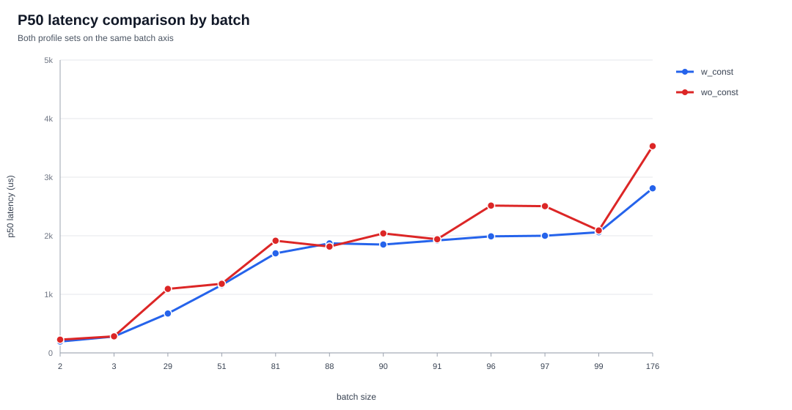
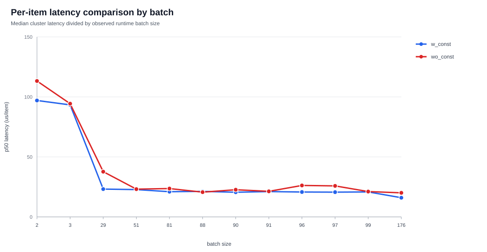
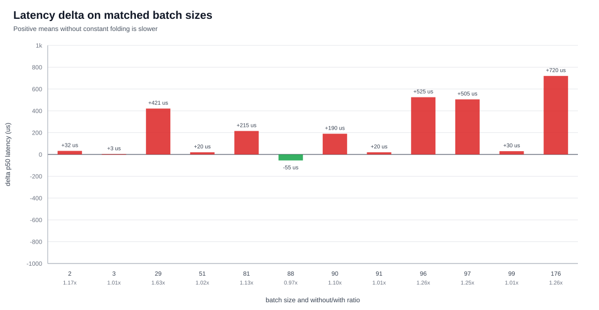
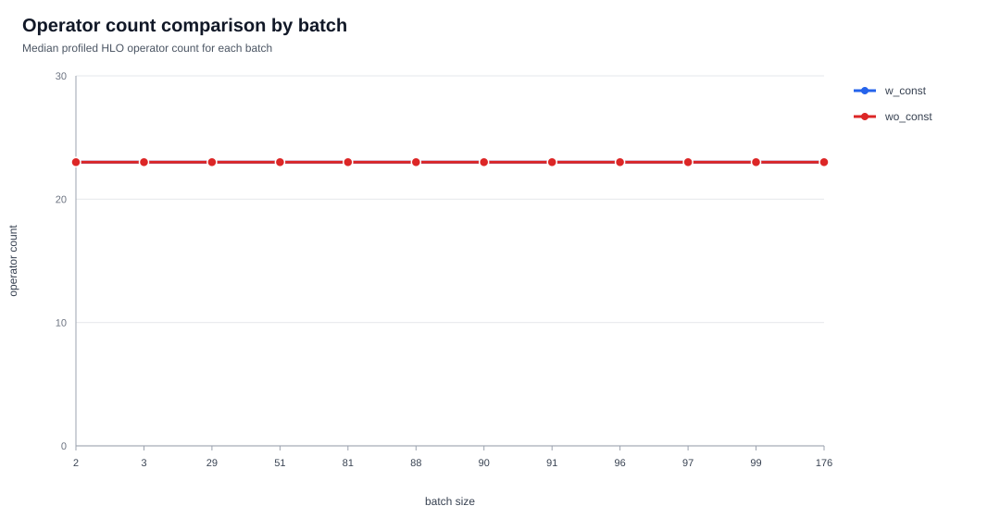
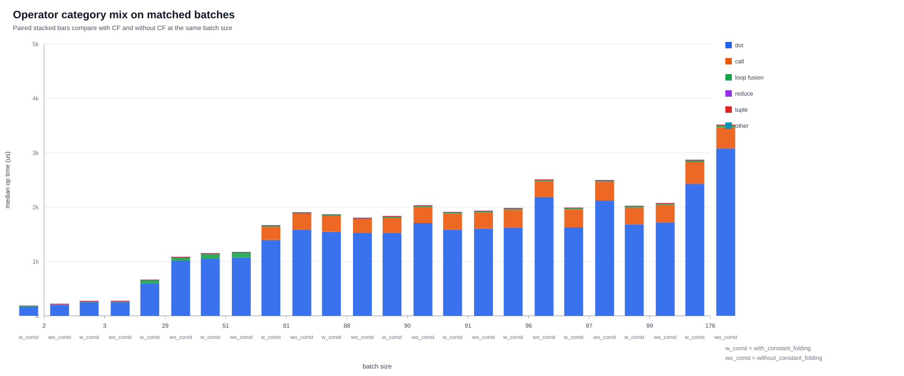
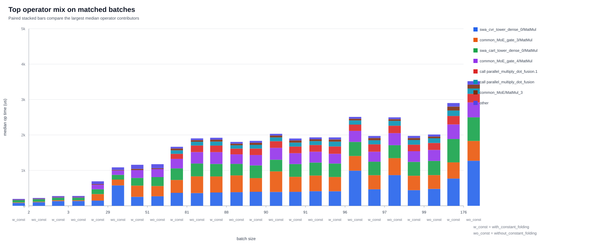

# Constant Folding Comparison for XLA Cluster 3

Cluster: `cluster_3__XlaCompiledKernel_true__XlaHasReferenceVars_true__XlaNumConstantArgs_0__XlaNumResourceArgs_0_.180`
With constant folding log: `/home/utku/projects/JD_DUMP/jd-new/JD/cvr/hlo_profile/with_constant_folding/cvr.log`
Without constant folding log: `/home/utku/projects/JD_DUMP/jd-new/JD/cvr/hlo_profile/without_constant_folding/cvr.log`
Figure labels: `wo_const` = without_constant_folding, `w_const` = with_constant_folding.

Parsed 34 with-folding executions and 24 without-folding executions.
Observed with-folding batches: 2, 3, 29, 51, 81, 88, 90, 91, 96, 97, 99, 176.
Observed without-folding batches: 2, 3, 29, 51, 81, 88, 90, 91, 96, 97, 99, 176.
Matched batch sizes: 2, 3, 29, 51, 81, 88, 90, 91, 96, 97, 99, 176.
Median without/with p50 latency ratio across matched batches: 1.115x.
Lowest ratio: batch 88 at 0.971x.
Highest ratio: batch 29 at 1.626x.

## Figures

## Interpretation

The matched runtime profiles have the same median profiled HLO op count: 23 ops for `w_const` and 23.0 ops for `wo_const` at each matched batch size.
So the latency gap is not explained by extra HLO operators. `wo_const` is slower on 11 of 12 matched batches; only batch 88 is faster.
The slowdown is concentrated in a few high-cost `dot`/MatMul sites rather than broad changes across all ops.

Largest aggregate median operator deltas, summed across matched batch sizes (`wo_const - w_const`):

| operator | aggregate delta us |
| --- | ---: |
| `model/swa_cvr_tower/swa_cvr_tower_dense_0/MatMul` | +2003.2 |
| `model/common_MoE/common_MoE_gate_3/MatMul` | +469.4 |
| `model/common_MoE/common_MoE_gate_4/MatMul` | +144.1 |
| `model/swa_cart_tower/swa_cart_tower_dense_0/MatMul` | +43.7 |
| `call:parallel_multiply_dot_fusion.1` | +8.9 |
| `model/Sum` | +2.8 |

Concrete examples from the matched logs:

- Batch 29 is mostly explained by `model/swa_cvr_tower/swa_cvr_tower_dense_0/MatMul`: `147.0 us -> 576.0 us` (`+429.1 us`).
- Batch 81 is mainly `model/common_MoE/common_MoE_gate_3/MatMul` (`+108.6 us`), `model/common_MoE/common_MoE_gate_4/MatMul` (`+54.2 us`), and `call:parallel_multiply_dot_fusion.1` (`+42.5 us`).
- Batch 176 is again dominated by `model/swa_cvr_tower/swa_cvr_tower_dense_0/MatMul`: `768.4 us -> 1271.4 us` (`+503.0 us`).
- Batch 88 is the exception where `wo_const` is slightly faster overall. Its `common_MoE_gate_3/MatMul` is slower, but `common_MoE_gate_4/MatMul`, `swa_cart_tower_dense_0/MatMul`, and the two parallel call sites are faster enough to offset it.

The optimized HLO text in these two directories is useful as a codegen clue, but not a strict apples-to-apples generated-code comparison: the dumped `w_const` cluster specialization has entry shapes with leading dimension `29`, while the dumped `wo_const` specialization has leading dimension `88`. In those dumped specializations, `wo_const` also contains explicit `call` ops to `parallel_multiply_dot_fusion*` with `outer_dimension_partitions`, whereas the dumped `w_const` specialization keeps the corresponding output-layer work as direct fusions. That supports the profile-level conclusion: constant folding did not change the profiled op count, but it changed specialization/codegen/fusion/partitioning enough that the same logical MatMul-heavy work runs with different per-op cost.

## Matched Batch Summary

| batch | with p50 ms | without p50 ms | delta us | without/with | with us/item | without us/item |
| ---: | ---: | ---: | ---: | ---: | ---: | ---: |
| 2 | 0.194 | 0.227 | +32 | 1.168x | 97.000 | 113.250 |
| 3 | 0.280 | 0.283 | +3 | 1.011x | 93.333 | 94.333 |
| 29 | 0.672 | 1.093 | +421 | 1.626x | 23.172 | 37.690 |
| 51 | 1.160 | 1.180 | +20 | 1.017x | 22.745 | 23.137 |
| 81 | 1.700 | 1.915 | +215 | 1.126x | 20.988 | 23.642 |
| 88 | 1.870 | 1.815 | -55 | 0.971x | 21.250 | 20.625 |
| 90 | 1.850 | 2.040 | +190 | 1.103x | 20.556 | 22.667 |
| 91 | 1.920 | 1.940 | +20 | 1.010x | 21.099 | 21.319 |
| 96 | 1.990 | 2.515 | +525 | 1.264x | 20.729 | 26.198 |
| 97 | 2.000 | 2.505 | +505 | 1.252x | 20.619 | 25.825 |
| 99 | 2.060 | 2.090 | +30 | 1.015x | 20.808 | 21.111 |
| 176 | 2.810 | 3.530 | +720 | 1.256x | 15.966 | 20.057 |

## Generated CSVs

- `comparison_summary.csv`: p50 latency and per-item latency by batch.
- `category_comparison.csv`: median category time deltas by batch.
- `operator_comparison.csv`: median operator time deltas by batch.
